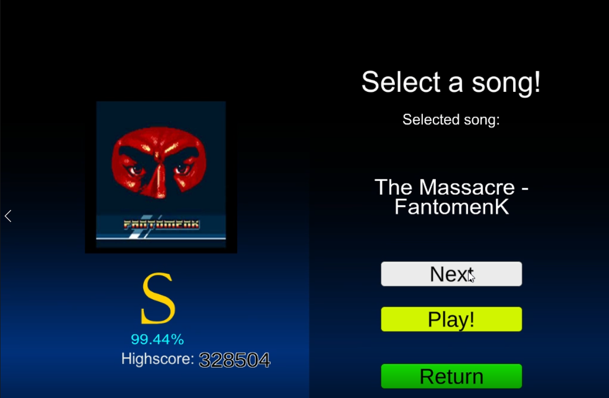
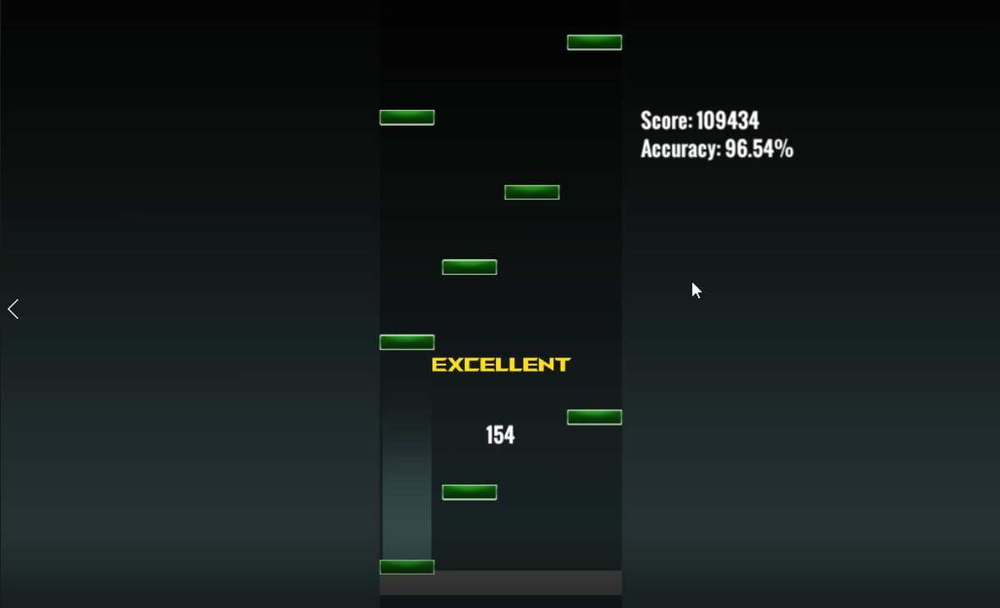
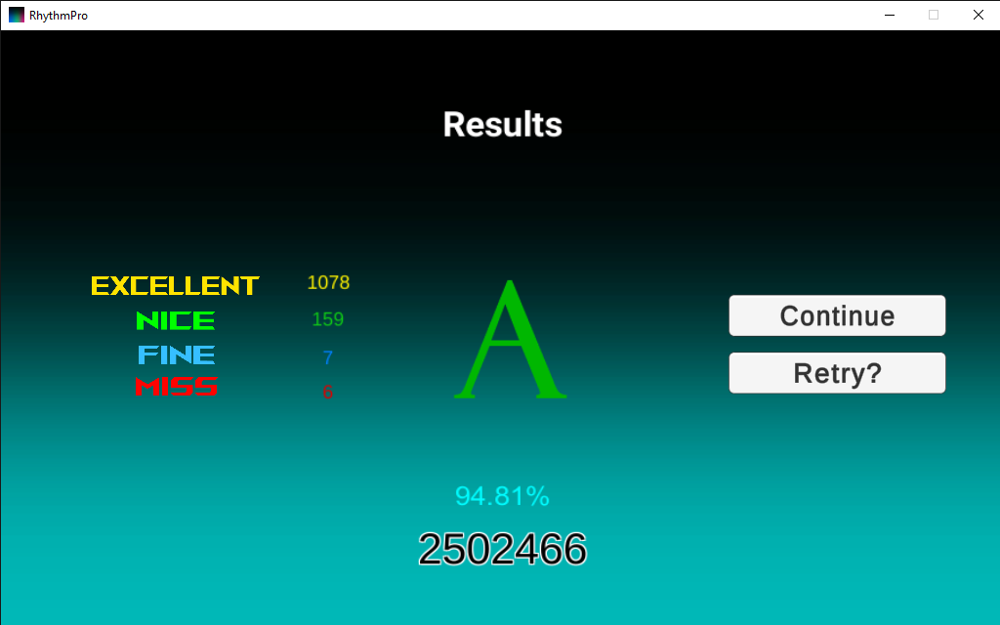

# Made by Anthony Ge for DCDS 2022 Senior Project

Feel free to playtest this small demo game! Built in Unity over the span of a month.

# CONTROLS:
- Use keys "a","s","j","k" to hit notes. Try to hit the notes once they hit the grey bar to ensure full accuracy; it is best recommended to listen to the music to time your hits!

# DOWNLOADING:
- Download the "Build" file as a ZIP and extract it to any location on your computer. Simply open the "RhythmPro" application to start playing!

## Screenshots

